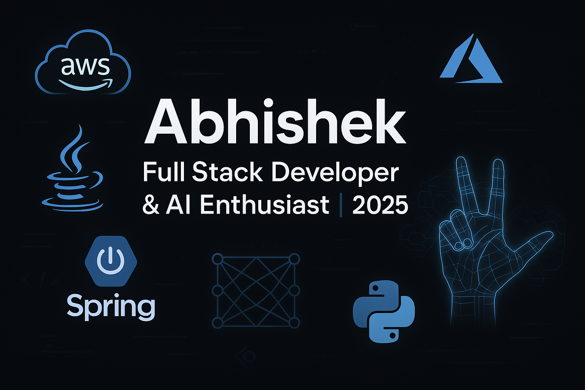

  

<h1 align="center">Hey there! I'm Abhishek 👋</h1>

🚀 Java Full Stack Developer | ☁️ Cloud Engineer | 🧠 AI & ML Enthusiast | 🎓 M.A.Sc @ Memorial University, 2025

---

## 🧑‍💻 About Me

🌟 I'm a passionate **Java Full Stack Developer** with **3+ years of experience** building scalable backend systems and solving real-world challenges in healthcare and loyalty domains.

🎓 Recently completed my **Master’s in Applied Science in Computer Engineering** from **Memorial University of Newfoundland** (2025).

🛠️ I love working with microservices, cloud infrastructure, and also dabble in ML/AI, especially for real-time gesture recognition and computer vision!

---

## 🏗️ My 2025 Projects

### 📊 Expense Tracker Web App – _Jan 2025 – Apr 2025_

A full-stack platform to manage finances, visualize budgets, and analyze spending patterns.

**Tech Stack**: Java 21, Spring Boot 3.2, PostgreSQL, Docker, EC2, NextJS, Tailwind CSS  
📌 _Secure APIs with JWT | Dockerized Backend | Realtime Budget Tracking_

---

### 🤖 Real-Time Gesture Recognition iOS App – _May 2024 – Dec 2024_

Gesture recognition using **MediaPipe**, **Conv2D CNNs**, and secure video processing for edge devices.

**Tech Stack**: TensorFlow, Python, iOS, MediaPipe, scikit-learn  
📌 _Real-time AI | 40-class model | Secure ML video workflow_

---

## 💼 Experience

### 🧩 **Engineer 2 @ Apexon** _(Jan 2023 – Aug 2023)_

### 🧩 **Engineer 1 @ Apexon** _(Aug 2021 – Jan 2023)_

-   Built scalable APIs with Spring Boot and Kafka
-   Integrated multiple vendor systems (Magento, Loyaltics, Akhil Systems)
-   Developed microservices with MongoDB, MySQL, and Azure Functions
-   Architected asynchronous systems using Kafka
-   Delivered solutions in **healthcare and loyalty platforms**

🛠️ _Skills_: Java 8/11, Azure, AWS, MongoDB, Kafka, REST APIs, Serverless

---

### ⚙️ **Site Reliability Engineer @ Crest Data Systems** _(Jul 2020 – Aug 2021)_

-   Automated Splunk CloudOps using Jenkins, Python, and Shell
-   Built CI/CD pipelines and deployed apps to multi-site clusters
-   Debugged and optimized distributed Splunk environments

---

## 🛠️ Tech Stack

| Domain          | Tools & Technologies                                |
| --------------- | --------------------------------------------------- |
| Languages       | `Java (8/11/21)` `Python` `Shell`                   |
| Backend         | `Spring Boot` `Spring MVC` `JPA` `Apache Kafka`     |
| Frontend        | `React` `NextJS` `Tailwind CSS`                     |
| Databases       | `MySQL` `MongoDB` `PostgreSQL` `Redis`              |
| Cloud Platforms | `Azure (Blob, Functions, AKS)` `AWS (EC2, S3)`      |
| DevOps & Tools  | `Jenkins` `Docker` `Git` `Log4j` `ElasticSearch`    |
| Architecture    | `Microservices` `Serverless` `Asynchronous Systems` |
| AI & ML         | `TensorFlow` `MediaPipe` `scikit-learn`             |

---

## 📈 GitHub Stats

  
  

---

## 🌐 Connect With Me

-   📬 [LinkedIn](https://www.linkedin.com/in/abhishekvvyas)
-   🌐 [Portfolio Website](https://your-portfolio-link.com)

---

## ✨ Fun Facts in 2025

-   🧠 I blend backend tech with AI/ML to solve real-world problems.
-   🚴‍♂️ I enjoy long bike rides and coding marathons.
-   📚 I love exploring new libraries, frameworks, and startup ideas!

---

> _"Clean code + scalable architecture = great user experience."_ – Abhishek
